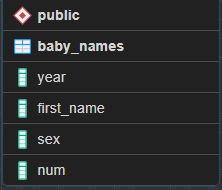
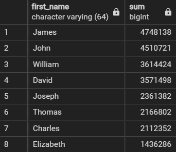
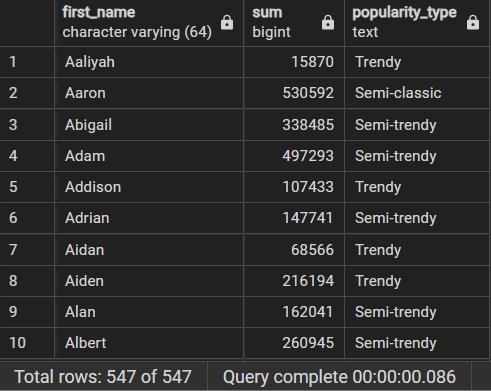
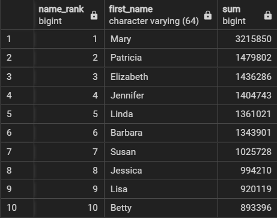
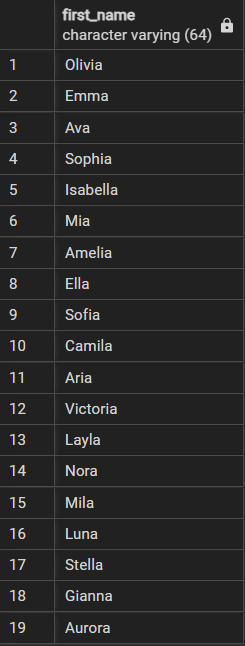
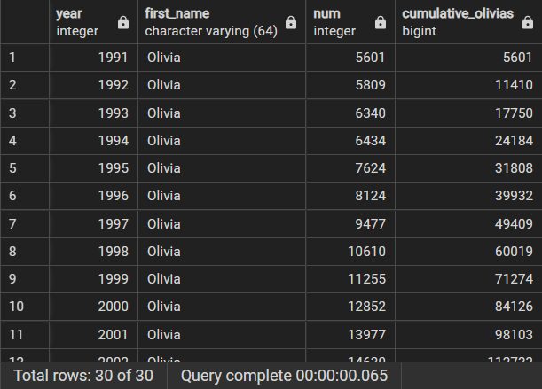
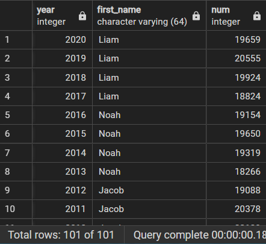
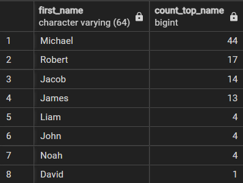
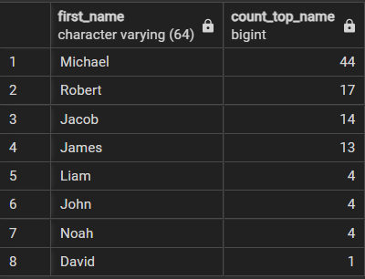

# Trends-in-U.S.-baby-names
This project uses data from the U.S. Social Security Administration over more than a century to explore the eternal question: what makes a name timeless or modern? By analyzing trends in baby names, we will discover how preferences have evolved over time, an essential skill for both parents and companies seeking to understand societal trends.

## Requirements
- Postgresql 15
- pgAdmin 4

## Databases
ER Model



## Queries
- ## Classic American names
```
SELECT first_name,
       SUM(num)
FROM baby_names
GROUP BY first_name
HAVING COUNT(year) = 101
ORDER BY SUM(num) DESC;
```


- ## Timeless or trendy?
```
SELECT first_name, SUM(num),
   CASE WHEN COUNT(year) > 80 THEN 'Classic'
        WHEN COUNT(year) > 50 THEN 'Semi-classic'
        WHEN COUNT(year) > 20 THEN 'Semi-trendy'
        ELSE 'Trendy' END AS popularity_type
FROM baby_names
GROUP BY first_name
ORDER BY first_name;
```


- ## Top-ranked female names since 1920
```
SELECT 
      RANK() OVER(ORDER BY SUM(num) DESC) AS name_rank,
      first_name, SUM(num)
FROM baby_names
WHERE sex = 'F'
GROUP BY first_name
LIMIT 10;
```


- ## Picking a baby name
```
SELECT first_name
FROM baby_names
WHERE sex = 'F' AND year > 2015
AND first_name LIKE '%a'
GROUP BY first_name
ORDER BY SUM(num) DESC;
```


- ## The Olivia expansion
```
SELECT year, first_name, num,
       SUM(num) OVER (ORDER BY year) AS cumulative_olivias
FROM baby_names
WHERE first_name = 'Olivia'
ORDER BY year;
```


- ## Many males with the same name
```
SELECT year, MAX(num) AS max_num
FROM baby_names
WHERE sex = 'M'
GROUP BY year;
```


- ## Top male names over the years
```
SELECT b.year, b.first_name, b.num
FROM baby_names AS b
INNER JOIN(
      SELECT year, MAX(num) as max_num
      FROM baby_names
      WHERE sex = 'M'
      GROUP BY year) AS subquery 
ON subquery.year = b.year
AND subquery.max_num = b.num
ORDER BY year DESC;
```


- ## The most years at number one
```
WITH top_male_names AS (
    SELECT b.year, b.first_name, b.num
    FROM baby_names AS b
    INNER JOIN(
          SELECT year, MAX(num) as max_num
          FROM baby_names
          WHERE sex = 'M'
          GROUP BY year) AS subquery 
     ON subquery.year = b.year 
          AND subquery.max_num = b.num
     ORDER BY year DESC
        )
SELECT first_name, COUNT(first_name) AS count_top_name
FROM top_male_names
GROUP BY first_name
ORDER BY count_top_name DESC;
```


## Technology Stack
- Postgresql 15


